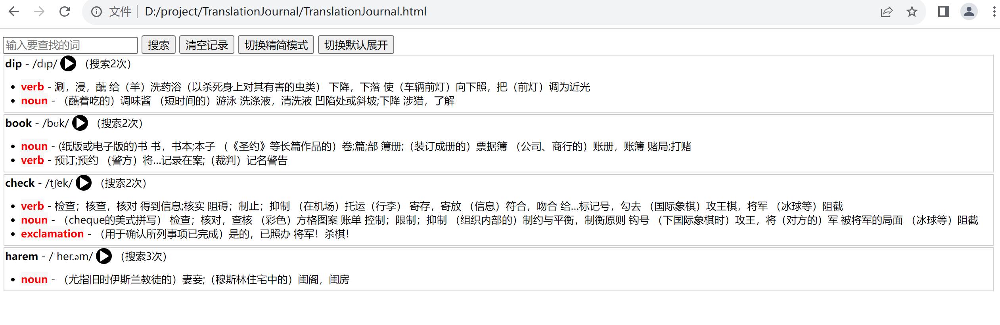

# TranslationJournal
English Translator - A single-page Vue application that allows you to easily translate and record all your translation history  
一个能记录英语翻译查询历史的单页应用，只有一个html文件。  
  
Requires enabling Chrome's insecure mode to bypass CORS policy  
需要开启不安全模式的chrome以忽略CORS策略，Win + R执行：<code>chrome.exe --disable-web-security --user-data-dir="C:\path\to\temp\directory"</code>  
    
That's how it look like

